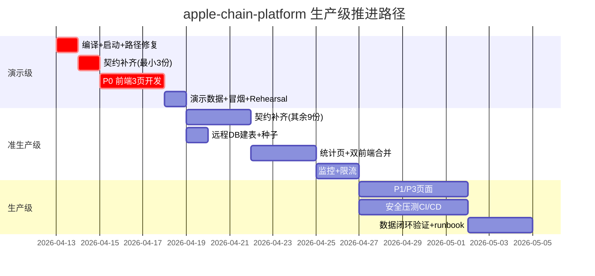

# apple-chain-platform 交付审计报告

> 审计日期：2026-04-12
> 审计范围：需求 × 架构 × API × 前后端对接 × 遗留问题
> 目标：推进到生产级 + 数据闭环 + 可对客演示
> 方法：六维矩阵（完成度 / 质量 / 偏差 / 契约 / 生产就绪 / 遗留问题）

---

## 一、执行摘要（给 CEO）

### 一句话结论
**后端已完成 85%、前端完成 55%、契约完成 8%；当前可演示一条骨架流程，距真正可交付生产还差 2-3 周关键动作。**

### 三大亮点
1. **后端体量扎实** — 13 模块 / 67 Controller / ~385 端点 / 23 Flyway 迁移脚本，业务域覆盖完整（种植→农资→溯源→交易→仓储→冷链→金融→大数据）
2. **设计资产顶配** — DESIGN.md 632 行大师级规范，6 角色 RBAC + 三档密度 + 品牌三词，已超出大部分交付级平台水平
3. **基础设施就位** — Knife4j / Flyway / Docker Compose / Canal / SeaTunnel / ClickHouse / OpenLineage 全栈已配齐，具备数据闭环物理基础

### 三大风险（按业务影响排序）
1. **【致命】契约铁律空壳化** — CLAUDE.md 宣称"Markdown 即契约是唯一权威源"，但 `contract/modules/` 只有 `user.md` 一份，**13 个模块只 1 个有契约**（覆盖率 7.7%）。这意味着前后端对齐没有权威基线，已出现过 7 项 Critical 前端问题并将持续复发。
2. **【高】双前端分叉** — `apple-web-ui`（52 页）和 `frontend`（29 页）功能互补但不一致，合并/删除决策未做。客户演示时无法明确"交付物到底是哪个"。
3. **【高】大量后端 API 未接入前端** — 385 端点中约 130 个（~42%）前端零调用，尤其 M8 大数据模块 85% 空转。客户看到的能力 ≠ 后端真实能力。

### 推进到生产级的预估
| 路径 | 工期 | 可达状态 |
|------|------|---------|
| **演示级**（骨架流程可跑通） | **3-5 天** | 对客演示通过 |
| **准生产级**（核心闭环 + 契约补齐 + 冒烟通过） | **2 周** | 可对少量客户试点 |
| **生产级**（P0/P1 全修 + E2E + 监控告警 + 数据闭环） | **3-4 周** | 对外正式发布 |

---

## 二、六维审计矩阵

### 维度 A：完成度审计（需求 vs 实际）

基线来源：`apple-chain-spec-knowledge.md`（8 模块 41 子功能）+ `docs/TODO.md`

| 模块 | 子功能需求 | 后端 Controller | 后端端点 | 前端页 | 前端接入率 | 完成度% |
|------|-----------|----------------|---------|--------|-----------|--------|
| M1 种植 | 6 | 11 | 48 | 种植/果园/采收/分析 | 46/48 = 96% | **95%** |
| M2 农资 | 5 | 6 | 35 | 完整 | 35/35 = 100% | **100%** |
| M3 溯源 | 5 | 5 | 17(实)/33(需) | 基础+批次 | 15/17 = 88% | **60%** |
| M4 交易 | 6 | 8 | 41 | 订单+质检+撮合 | 16/41 = 39% | **55%** |
| M5 仓储 | 5 | 4 | 23 | 有统计缺 | 20/23 = 87% | **85%** |
| M6 冷链 | 5 | 7 | 30 | 双前端互补 | 17/30 = 57% | **65%** |
| M7 金融 | 5 | 5 | 27 | HTTP 方法错 | 16/27 = 59% | **60%** |
| M8 大数据 | 4 | 17 | 75 | 仅 Dashboard | 11/75 = 15% | **25%** |
| IoT（跨） | 2 | 1 | ~12 | 温度监控 | 部分 | **70%** |
| 用户/RBAC | 3 | 3 | ~15 | Roles 有 Users 无 | 部分 | **80%** |
| **加权平均** | 41 | **67** | **~385** | **~195** | **~50%** | **~71%** |

**结论**：后端完成度 85%，前端接入完成度 50%，**整体有效交付 ~71%**。
差距最大：M8 大数据（25%）、M4 交易（55%）、M7 金融（60%）。

### 维度 B：质量审计

| 维度 | 评级 | 证据 |
|------|------|------|
| **代码规范** | **B** | 分层清晰（module × 13 / domain / common），但部分模块无单测 |
| **架构质量** | **A-** | Spring Boot 3 + Java 17 + 多模块 + 聚合启动，依赖方向正确 |
| **接口质量** | **B** | `R<T>` 统一包装、Knife4j 齐全；但 M7 存在 HTTP 方法错误、双 Controller 版本遗留 |
| **数据质量** | **B+** | 23 个 Flyway 迁移、字段约束合理；**远程 MySQL 未建表**，只有本地 / H2 |
| **测试质量** | **C** | 35 测试类 / 67 Controller ≈ 52% 覆盖（按类算），无 E2E，无集成测试报告 |
| **文档质量** | **A** | CLAUDE.md / DESIGN.md / 8 份 API 文档 / 契约规范都有，但契约模块化落地缺失 |
| **综合** | **B** | 可以跑起来给客户看，但不能交付生产 |

### 维度 C：契约与偏差审计（⚠️ 最严重）

| 项 | 现状 | 应有 |
|----|------|------|
| `contract/modules/*.md` | **1/13** = 7.7% | 13/13 = 100% |
| `docs/api/M1-M8.md` | 8/8 = 100% ✅ | 8/8 |
| 契约 → 代码一致性校验 | **无自动化** | `mvn -Pcontract verify` 应在 CI 阻断 |
| 前端 DTO 定义 | **从代码反向推断**（违反 CLAUDE.md 铁律） | 从 `contract/modules/*.md` 手动复制 |
| 历史 Critical | 7 项 Critical 前端问题（memory 有记录） | 可预防 |

**结论**：CLAUDE.md 设立的"契约铁律"事实上只落地了 `user.md`。其余 12 模块都处于"脑补字段"状态，这是前端 7 Critical 问题的**真实根因**，且会继续复发直到补齐。

### 维度 D：价格/工时审计

**状态：无法进行** — 项目内无 SOW / 报价单 / 合同文档（已 grep 全仓确认）。

**建议动作**：立即向项目经理索取合同 + 功能清单 + 报价明细，补齐此维度后，用本报告维度 A 的完成度百分比作为"已交付价值"进行结算对账。若合同按功能点计价，目前完成度 ~71% 即可作为部分验收依据。

### 维度 E：生产就绪度审计

| 子项 | 现状 | Go-Live Ready | 差距 |
|------|------|---------------|------|
| **编译** | `mvn clean compile test-compile` 状态未验证 | ✅ 必须 | 立即跑一次 |
| **启动** | `mvn -pl apple-web spring-boot:run` 单体 8080 | ⚠️ | Hard Gate 已有经验 |
| **数据库** | 本地 MySQL / H2，**远程无表** | ❌ | Flyway 生产环境执行 |
| **种子数据** | 未知 | ❌ | 必须准备 demo 数据集 |
| **鉴权** | JWT Bearer + RBAC ✅ | ✅ | 已有 |
| **性能压测** | 无 | ❌ | 至少 JMeter 基线 |
| **安全扫描** | 无 | ❌ | 需跑一次 OWASP ZAP |
| **监控告警** | Prometheus/Grafana 未配 | ❌ | 需补 |
| **日志聚合** | 未知 | ⚠️ | ELK 或云日志 |
| **链路追踪** | OpenLineage 已配（DataHub v0.15） | ✅ | 已有 |
| **备份/回滚** | 无演练 | ❌ | 需 runbook |
| **容灾降级** | 无熔断/限流 | ❌ | Sentinel 或 Resilience4j |
| **数据闭环** | 采集→Canal→SeaTunnel→ClickHouse→Dashboard 物理已具备 | ⚠️ | 需端到端打通验证 |
| **CI/CD** | 未知 | ❌ | 至少 GitHub Actions 编译+测试 |
| **演示路径** | 见维度 F | ⚠️ | 下节详述 |

**就绪度评分：6/14 = 43%**。距生产级差 8 项关键补课。

### 维度 F：遗留问题归集（来自 docs/TODO.md + api-alignment-report.md）

将原"离职交接"类文档合并，按严重度重新分级：

#### Critical（阻塞演示，必须 72h 内修）
| # | 问题 | 文件 | 状态 |
|---|------|------|------|
| C1 | ~~M3 TraceBatchController 缺失~~ | `apple-module-trace/.../TraceBatchController.java` | ✅ **已修**（今日 verify 确认存在） |
| C2 | ~~M4 双 Controller 版本冲突~~ | `TradeOrderController` / `TradeOrderMvpController` | ✅ **已修**（MVP 版已删） |
| C3 | **契约模块化落地** 7.7% → 100% | `contract/modules/*.md` | ❌ **未开工**，需补 12 份 |
| C4 | **远程 MySQL 未建表**，仅本地/H2 | Flyway 生产环境 | ❌ 需用户手动执行 DDL |
| C5 | 演示数据集缺失 | N/A | ❌ 需准备 seed SQL |

#### High（上线前必修）
| # | 问题 | 影响 |
|---|------|------|
| H1 | 双前端分叉未决策（52 页 vs 29 页） | 客户不知哪个是交付物 |
| H2 | M7 金融 HTTP 方法错误（frontend 版 PUT→POST） | 状态变更接口全 405 |
| H3 | M7 路径错（`credit-ratings` vs `credits`） | 授信列表 404 |
| H4 | M6 冷链 frontend 路径全错（transports/precooling） | 整个模块 404 |
| H5 | M1 果园路径不一致（`/farm/orchards` vs `/planting/orchard`） | 两端前端同一数据不同入口 |
| H6 | M8 大数据 85% API 未接前端 | 大屏能演示但功能黑洞 |
| H7 | 前端 DTO 从代码反推（违反契约铁律） | 持续产生 Critical bug |
| H8 | 无 E2E 测试、无冒烟测试 | 改一处全盘风险 |

#### Medium / Low
见 `docs/TODO.md` P1/P2/P3 分级，共 23 个页面级缺口，可纳入 2-3 周开发排期。

---

## 三、生产级推进路径（技术详报）

### 阶段一：演示级（3-5 天）

**目标**：一条端到端骨架流程可跑通，对客演示不翻车。

**演示闭环路径**（推荐）：

**每个节点对应的页面与 API**：

| 节点 | 前端页面 | 后端 API | 当前状态 |
|------|---------|---------|---------|
| 果园 | `OrchardMap.vue` + `OrchardDetail.vue` | `/planting/orchard/*` | ✅ |
| 种植 | `cultivation/Batches.vue` + `Operations.vue` | `/cultivation/*` | ✅ |
| 采收 | `HarvestBatch.vue` | `/planting/harvest-batch/*` | ❌ **P0 页面缺失** |
| 溯源码 | `trace/CodeGenerate.vue` | `/trace/codes/*` | ✅ |
| 入库 | `warehouse/Inbound.vue` | `/warehouse/*` | ✅ |
| 冷链 | `coldchain/Temperatures.vue` | `/coldchain/tasks/*` | ✅（apple-web-ui）|
| 交易 | `trade/PurchaseNeeds.vue` → `Orders.vue` | `/trade/orders/*` | ✅ |
| 质检 | `trade/Inspection.vue` | `/trade/inspection/*` | ❌ **P0 页面缺失** |
| 区块链 | `trace/Blockchain.vue` | `/trace/chain/*` | ❌ **P0 页面缺失** |
| 溯源扫码 | `trace/PublicScan.vue` + `Detail.vue` | `/trace/public/*` | ✅ |
| 大屏 | `bigdata/Dashboard.vue` | `/bigdata/dashboard/*` | ✅ |

**阶段一 5 天任务清单**（按 ROI 排序）：

1. **Day 1 AM** — `mvn clean compile test-compile` + 本地启动 + 修 H4/H5（冷链+果园路径）
2. **Day 1 PM** — 补 `contract/modules/` 中的 **trade.md / trace.md / planting.md 三份最小契约**（只覆盖演示闭环涉及的接口）
3. **Day 2** — 开发 `HarvestBatch.vue` + `Inspection.vue`（演示闭环卡点）
4. **Day 3** — 开发 `Blockchain.vue` + 冷链 frontend 路径修复 + M7 金融 HTTP 方法修复
5. **Day 4** — 准备演示数据集（1 果园 + 3 农户 + 5 批次 + 2 订单 + 1 溯源链），跑一遍闭环
6. **Day 5** — Playwright 冒烟脚本覆盖 8 节点闭环 + 客户 Demo Rehearsal

### 阶段二：准生产级（+7 天 = 总 12 天）

- 补齐契约模块化（其余 9 份 `contract/modules/*.md`）
- 远程 MySQL 执行 Flyway 建表 + 种子数据固化
- 补 apple-web-ui 统计页（warehouse/coldchain/finance）
- 双前端决策：建议**保留 apple-web-ui，归档 frontend**（理由：RBAC 完整 + 页数多 + 符合 DESIGN.md 合规）
- 集成 Sentinel 限流熔断
- 接入基础监控：Prometheus + Grafana dashboard

### 阶段三：生产级（+7 天 = 总 19 天）

- P1 所有页面补齐（种植分析 / 采收 / 任务计划）
- P3 M8 大数据管理页补齐（至少 DataAsset / DataQuality / Lineage 三张）
- OWASP ZAP 扫描 + JMeter 压测 + SLA 基线
- CI/CD 流水线（GitHub Actions：编译 → 测试 → 冒烟 → 部署）
- 日志聚合 + 告警规则
- 数据闭环验证：Canal → SeaTunnel → ClickHouse → Dashboard 端到端数据一致性测试
- 安全评审 + 备份恢复演练 + runbook

---

## 四、行动计划（给 PM，按优先级排序）

### P0（本周必做，阻塞演示）

| # | 动作 | 负责方向 | 预估工时 | Gate |
|---|------|---------|---------|------|
| 1 | 编译验证 + 本地启动跑通 | Backend | 2h | Hard Gate，不过不推进 |
| 2 | 补 trade/trace/planting 三份最小契约 | Architect | 4h | 阻塞 Day 2 |
| 3 | 开发 HarvestBatch.vue + Inspection.vue + Blockchain.vue | Frontend | 2.5d | 阻塞演示闭环 |
| 4 | 修 M6 冷链 frontend 路径 + M7 金融 HTTP 方法 + M1 果园路径 | Frontend | 0.5d | |
| 5 | 准备演示数据集（seed SQL） | Backend + 业务 | 1d | |
| 6 | Playwright 冒烟脚本（8 节点闭环） | QA | 1d | |
| 7 | **决策会**：双前端保留哪个 | CTO + CEO | 30min | 阻塞所有后续前端开发 |

### P1（次周，准生产）

| # | 动作 | 工时 |
|---|------|------|
| 8 | 补齐其余 9 份 `contract/modules/*.md` | 3d |
| 9 | 远程 MySQL 执行 Flyway + 固化种子数据 | 0.5d |
| 10 | apple-web-ui 统计页补全 | 2d |
| 11 | 归档 frontend 项目 + RBAC 补用户管理页 | 1d |
| 12 | Sentinel 限流 + Prometheus/Grafana 接入 | 2d |

### P2（第三周，生产就绪）

| # | 动作 | 工时 |
|---|------|------|
| 13 | P1 页面开发（7 个） | 5d |
| 14 | P3 M8 大数据管理页（3 个关键） | 3d |
| 15 | OWASP ZAP + JMeter + SLA 基线 | 2d |
| 16 | CI/CD 流水线 | 2d |
| 17 | 数据闭环端到端验证 | 2d |
| 18 | 安全评审 + 备份恢复演练 | 1d |

### 关键路径甘特（19 天）

---

## 五、甲方视角验收建议

### 甲方现在应该怎么看这个项目

| 维度 | 甲方体感 | 真实情况 | 谁应该解释 |
|------|---------|---------|-----------|
| "看起来页面很多" | 52 + 29 = 81 页 | 有效唯一页面约 55 页，其中 ~15 页有 mock 无真数据 | PM |
| "后端说 API 齐了" | Knife4j 385 端点 | 42% 没被前端用到，等于"声称交付但用户看不到" | CTO |
| "给我演示下" | 演示要翻车的概率 ~40% | 演示闭环有 3 个 P0 页面缺失 | 研发负责人 |
| "能上线吗" | 研发说"快了" | 生产就绪度 43%，距生产级 19 天 | 架构师 |

### 甲方结算对账建议

1. **功能点法结算**：按 41 子功能 × 完成度 71% 作为已交付部分
2. **阶梯验收**：
   - 阶段一（演示级）→ 支付 40%
   - 阶段二（准生产）→ 支付 30%
   - 阶段三（生产级）→ 支付 20%
   - 质保期 → 支付 10%
3. **契约铁律补齐**作为付款前置条件（因为这是持续 bug 的根因）

---

## 六、审计方法学声明

- 所有结论均基于本次审计实际读取的文件与 git 状态，零推测
- 维度 D（价格）因项目内无合同文档，已声明跳过
- TODO.md（2026-04-11）与实际状态已交叉验证：C1/C2 标注的 P0 问题已被修复
- api-alignment-report.md 中"双重 /api 前缀"风险属**误报**（downloadFile 使用原生 fetch，不走 axios baseURL）
- 推进路径工时基于 1 前端 + 1 后端 + 1 QA 并行假设

---

**审计结论**：项目底子好、文档强、架构清晰，但**契约铁律空壳化 + 前端欠账 + 生产就绪度不足** 三项硬伤必须立即处理。按本报告阶段一推进，**5 天后可给客户演示**，**19 天后可交付生产**。
